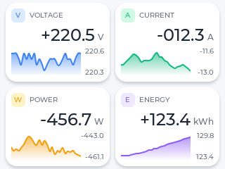
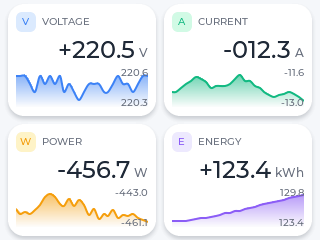

# LVGL 仪表盘 DEMO

LVGL v9.5.0 + SDL2 · 双页面数据仪表盘

## 页面

**CO₂ 数据仪表盘** — 浓度 + 24h 平滑渐变趋势图


**电力监控** — 电压 / 电流 / 功率 / 电量，`±XXX.X` 右对齐 + 渐变趋势图


## 渐变面积图思路（src/ui.c）

1. 整块 `lv_draw_rect` 垂直渐变矩形 → 真·平滑渐变
2. 逐列擦除曲线上方（擦除边界按 Catmull-Rom 贝塞尔逐列求值，与描线一致）
3. 擦除时同步画网格线（仅白色区）
4. 每列少擦 1px → 填充藏在描线下方，无接缝

> 不用 thorvg 渐变填充凹多边形：thorvg 会按包围盒填充，导致颜色溢出曲线外。

## 趋势图 Y 轴布局

电力趋势图支持两种 Y 轴显示方式，通过 CMake 宏 `LVGL_SIM_AXIS_OVERLAY` 切换：

### 第一版：右侧保留紧凑数轴区域（默认）

图表与数轴并排，右侧显示当前数据的最大值和最小值。



### 第二版：数轴文字叠加在 full-width 图表上

图表保持完整宽度，最大值和最小值直接叠加在图表右侧。



```bash
# 第一版：右侧紧凑数轴（默认）
cmake -S . -B build -DLVGL_SIM_AXIS_OVERLAY=0
cmake --build build

# 第二版：数轴文字叠加在 full-width 图表上
cmake -S . -B build-overlay -DLVGL_SIM_AXIS_OVERLAY=1
cmake --build build-overlay
```

## 运行

```bash
./build/lvgl_sim                     # 交互模式（空格切页）
./build/lvgl_sim --page=1 --screenshot=co2.png
./build/lvgl_sim --page=2 --screenshot=power.png
```

## 结构

`src/main.c` 入口 · `src/ui.c` 页面 UI · `src/png.c` PNG 写出 · `lv_conf.h` 配置